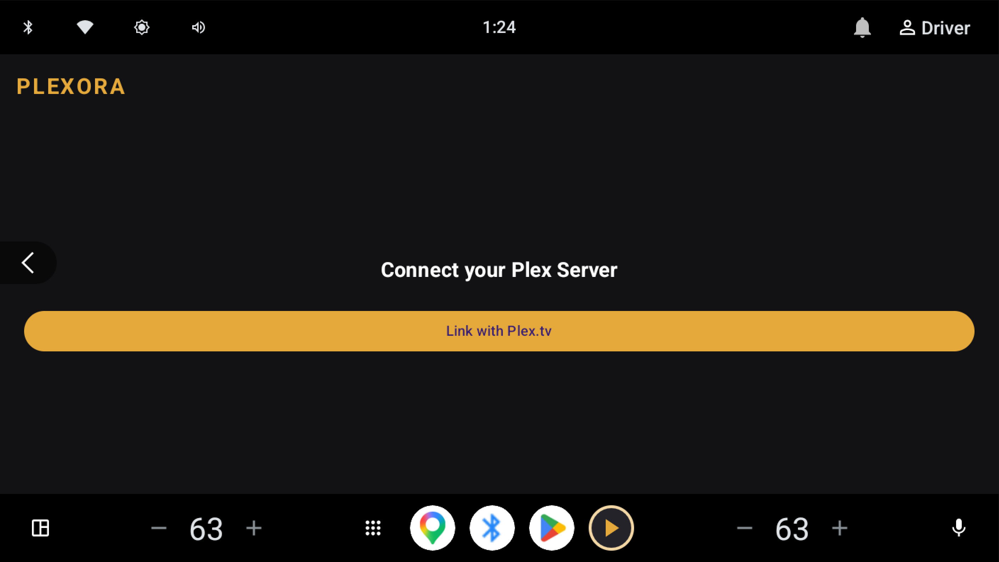
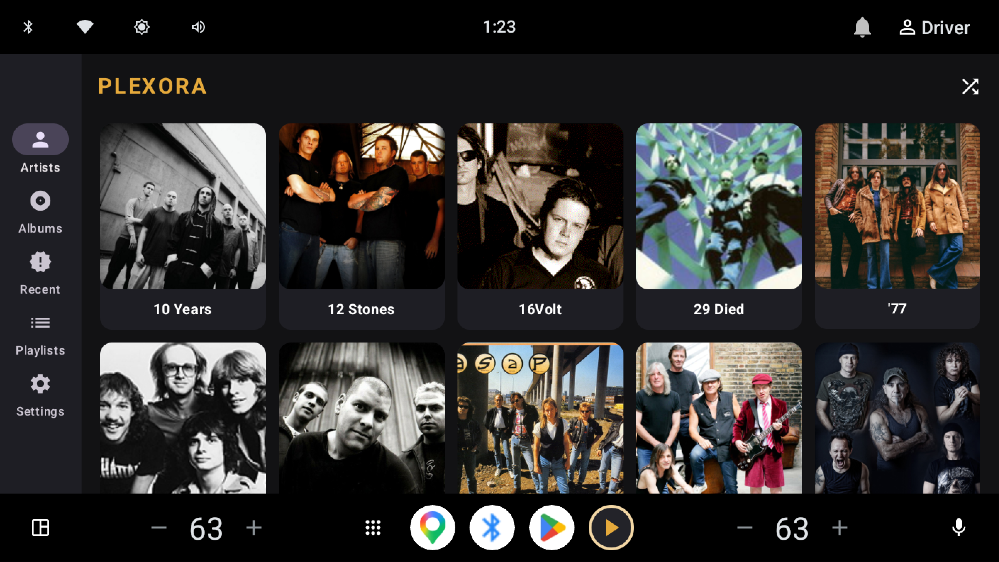
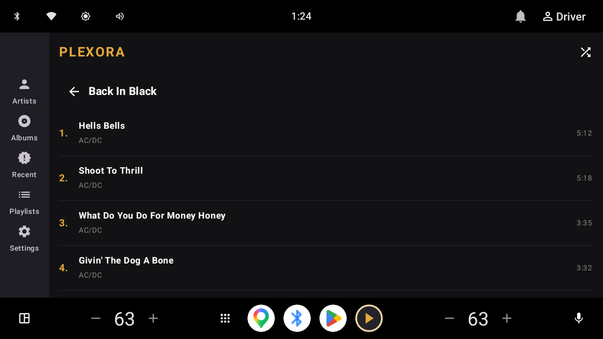
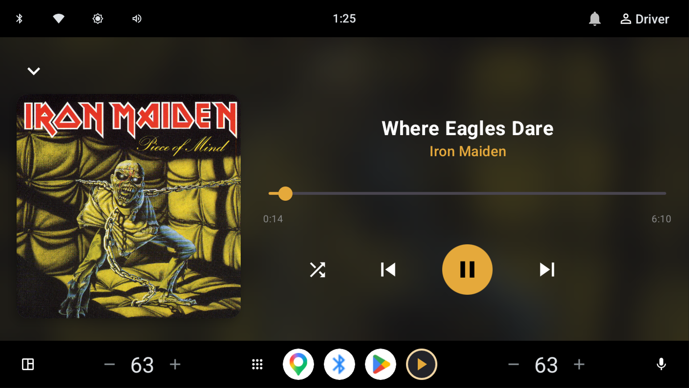

# Plexora

Plexora is a vibe-coded, modern, lightweight Plex client designed specifically for **Android Automotive OS**. Unlike traditional mobile apps, Plexora installs directly onto your vehicle's head unit to provide a native, high-performance music streaming experience.

## Features

- **Native Automotive UI**: A custom-built Jetpack Compose interface optimized for touch interaction on vehicle displays.
- **System Media Integration**: Fully compliant Media3 implementation that integrates with the vehicle's native media center, steering wheel controls, and instrument cluster.
- **Contextual Shuffle**: Intelligent single-button shuffle that understands whether you are browsing an Artist, Album, Playlist, or your entire library.
- **Search Support**: Integrated search functionality for finding Artists, Albums, and Tracks via voice or the system keyboard.
- **Seamless Setup**: Easy server linking via `plex.tv/link` PIN authentication directly on the head unit.
- **Optimized for Driving**: High-contrast, large touch targets and optimized caching for reliable playback even in areas with spotty connectivity.

## Screenshots

*(Capture these from your emulator to showcase the app)*

1. **Server Setup**  
     
   *Linking a Plex server using the secure PIN-based authentication flow.*

2. **Music Library**  
     
   *Browsing the artist library via the native Automotive OS interface.*

3. **Playlist & Shuffle**  
     
   *The playlist track list, featuring the intelligent contextual shuffle button in the top bar.*

4. **Now Playing**  
     
   *The immersive playback screen with large controls and blurred background artwork.*

## Technical Stack
- **UI**: Jetpack Compose
- **Media**: Media3 / ExoPlayer
- **Network**: OkHttp 4 & Plex API
- **Images**: Coil 2
- **Persistence**: SharedPreferences for session and state recovery.

## Getting Started

1. Clone the repository.
2. Open the project in Android Studio.
3. Build and deploy to your Android device.
4. Launch the app and follow the on-screen instructions to link your Plex server.

## License

This project is licensed under the MIT License.
